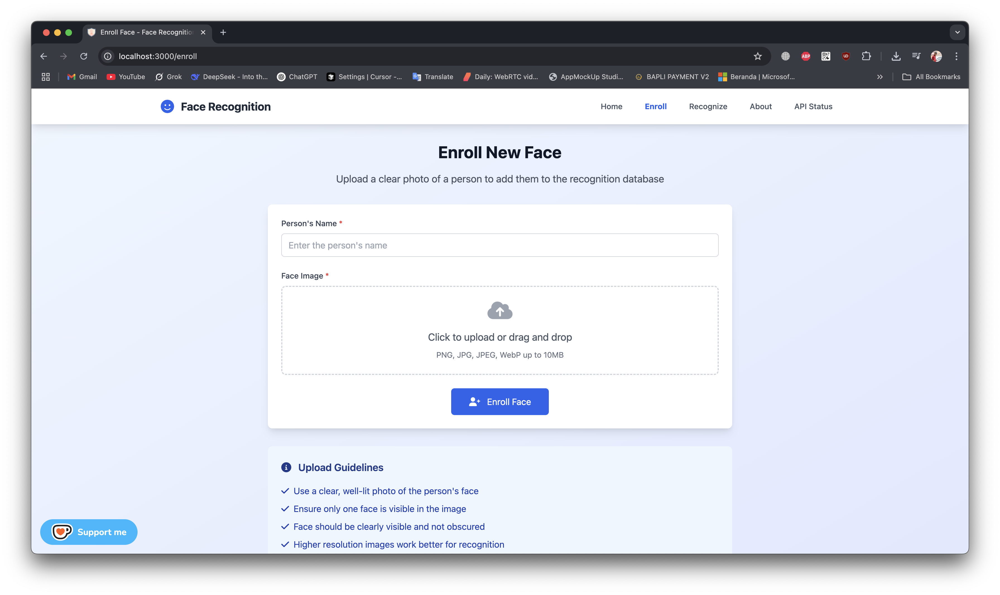
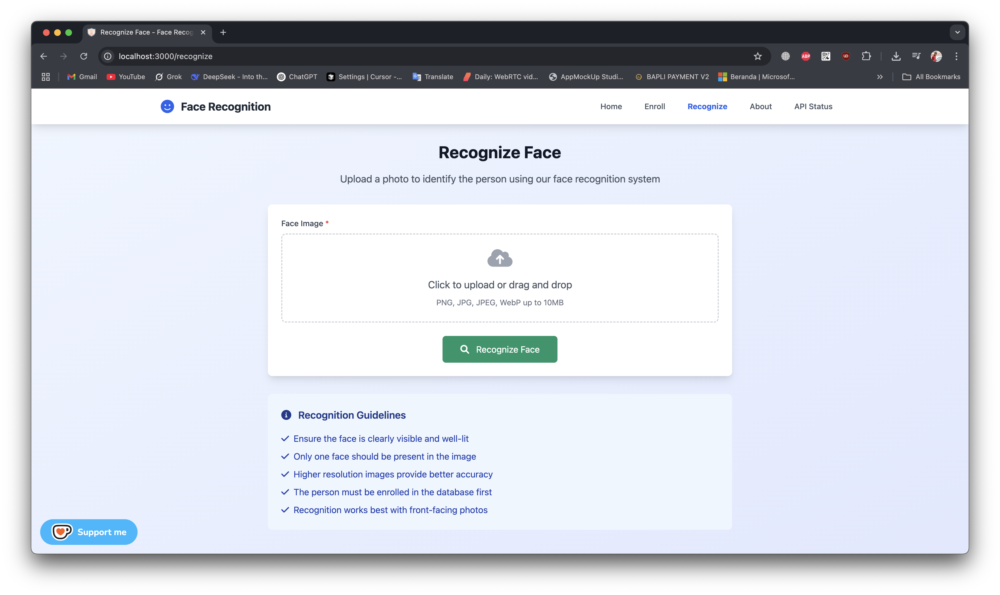
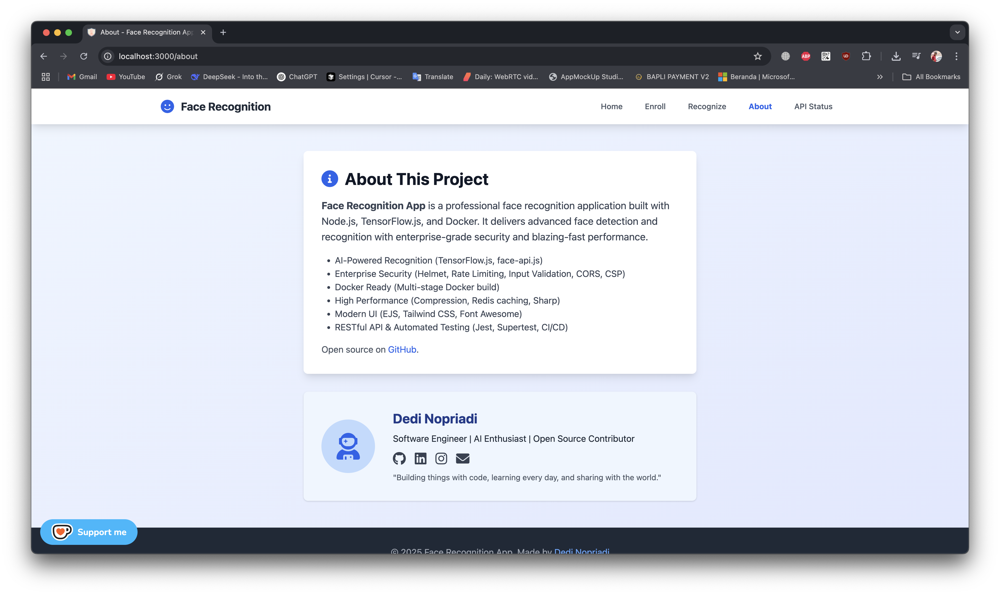

[](https://github.com/dedinopriadi/face-recognition-app/actions)


# 🎉 Face Recognition Application

A professional face recognition application built with Node.js, TensorFlow.js, and Docker. This project delivers advanced face detection and recognition with enterprise-grade security and blazing-fast performance. 

---

## 🚀 Features

✨ **AI-Powered Recognition**: Advanced face detection and recognition using TensorFlow.js and face-api.js  
🔒 **Enterprise Security**: Security best practices (rate limiting, input validation, secure file handling, CSP, CORS)  
🐳 **Docker Ready**: Multi-stage Docker build for consistent deployment  
⚡ **High Performance**: Optimized with compression, Redis caching, and efficient image processing  
💻 **Modern UI**: Responsive web interface (EJS + Tailwind CSS)  
🔗 **API First**: RESTful API endpoints for integration  
⏱️ **Real-time Processing**: Fast face detection and recognition with confidence scoring  
📋 **Comprehensive Logging**: Winston logger, request logging, error tracking  
🧪 **Automated Testing**: Jest, Supertest, CI/CD pipeline

## 📸 Demo & Screenshots

Here are some main views of the application:

### Home

_Main dashboard view of the Face Recognition app._

### Enroll Face

_Page to enroll a new face into the database._

### Recognize Face

_Page to recognize a face from an uploaded photo._

### About

_Project and developer profile page._

---

## 🛠️ Tech Stack

- **Backend**: Node.js, Express.js
- **AI/ML**: TensorFlow.js, face-api.js
- **Database**: SQLite3
- **Image Processing**: Sharp, Canvas
- **Security**: Helmet, Rate Limiting, Input Validation, CORS, CSP
- **Performance**: Compression, Redis Caching
- **Frontend**: EJS, Tailwind CSS
- **Containerization**: Docker, Docker Compose
- **Development**: ESLint, Prettier, Nodemon, Jest, Supertest

## 📋 Prerequisites

- Node.js >= 18.0.0
- npm >= 8.0.0
- Docker & Docker Compose (for containerized deployment)

## 🚦 Quick Start

1. **Clone the repository**
```bash
   git clone https://github.com/dedinopriadi/face-recognition-app.git
cd face-recognition-app
```
2. **Install dependencies**
```bash
npm install
```
3. **Download Face Recognition Models**
```bash
node scripts/download-models.js
   # Or download manually from:
# https://github.com/justadudewhohacks/face-api.js/tree/master/weights
# Place files in ./models directory
```
4. **Start development server**
```bash
npm run dev
```
5. **Access the application**
   - 🌐 Web UI: http://localhost:3000
   - 📝 Enroll Faces: http://localhost:3000/enroll
   - 🕵️ Recognize Faces: http://localhost:3000/recognize
   - 💓 Health Check: http://localhost:3000/health
   - 📊 API Status: http://localhost:3000/api/status

### 🐳 Docker Development
```bash
npm run docker:dev
# App: http://localhost:3000
# Redis: localhost:6379
# Redis Commander: http://localhost:8081
```

### 🚢 Production Deployment
```bash
npm run docker:prod
```

---

## 🛠 Project Structure

```
face-recognition-app/
├── src/
│   ├── config/
│   │   ├── database.js
│   │   ├── logger.js
│   │   ├── redis.js
│   │   └── config.js
│   ├── controllers/
│   │   └── faceController.js
│   ├── middleware/
│   │   ├── upload.js
│   │   └── validator.js
│   ├── routes/
│   │   └── faceRoutes.js
│   ├── services/
│   │   └── faceRecognitionService.js
│   ├── views/
│   │   ├── index.ejs
│   │   ├── enroll.ejs
│   │   ├── recognize.ejs
│   │   ├── 404.ejs
│   │   └── error.ejs
│   └── server.js
├── models/              # Face-api.js model files
├── data/                # SQLite database files
├── uploads/             # File uploads
├── public/              # Static assets
├── tests/               # Test files
├── scripts/             # Build and deployment scripts
├── Dockerfile           # Multi-stage Docker build
├── docker-compose.dev.yml
├── docker-compose.prod.yml
├── package.json
└── README.md
```

---

## 🔧 Configuration

### Environment Variables
Buat file `.env` di root project, contoh:
```env
NODE_ENV=development
PORT=3000
REDIS_HOST=redis
REDIS_PORT=6379
# REDIS_URL=redis://localhost:6379
UPLOAD_PATH=./uploads
MAX_FILE_SIZE=10485760
CORS_ORIGIN=http://localhost:3000
RATE_LIMIT_WINDOW_MS=900000
RATE_LIMIT_MAX_REQUESTS=100
```

---

## 🔒 Security Features
- **Helmet**: Security headers
- **CSP**: Content Security Policy strict
- **CORS**: Configurable via env
- **Rate Limiting**: Global & sensitive endpoint (Redis store)
- **Input Validation**: All endpoints
- **File Upload Validation**: Type, size, and content
- **User non-root**: Dockerfile prod

---

## 📚 API Documentation

### Health Check
```
GET /health
```
Returns application health status.

### API Status
```
GET /api/status
```
Returns API version and environment information.

### Face Recognition Health
```
GET /api/face/health
```
Returns face recognition service status and model loading status.

### Enroll New Face
```
POST /api/face/enroll
Content-Type: multipart/form-data
Body:
- name: string (required)
- image: file (required)
```
Enrolls a new face in the database.

### Recognize Face
```
POST /api/face/recognize
Content-Type: multipart/form-data
Body:
- image: file (required)
```
Recognizes a face against the enrolled database.

### Get All Faces
```
GET /api/face/faces
```
Returns all enrolled faces.

### Get Face by ID
```
GET /api/face/faces/:id
```
Returns specific face details.

### Delete Face
```
DELETE /api/face/faces/:id
```
Deletes a face from the database.

### Get Dashboard Data
```
GET /api/face/dashboard
```
Returns statistics and recent recognition logs.

### Get Statistics
```
GET /api/face/stats
```
Returns face recognition statistics.

---

## 🧪 Testing & Code Quality
```bash
npm test           # Run all tests
npm run test:watch # Watch mode
npm run lint       # Lint code
npm run lint:fix   # Auto-fix lint
npm run format     # Format code
```

---

## 🐳 Docker Commands
```bash
npm run docker:dev   # Development
npm run docker:prod  # Production
npm run docker:down  # Stop all containers
```

---

## 📊 Monitoring & Logging
- Health check: `/health`
- API status: `/api/status`
- Face recognition health: `/api/face/health`
- Request logging with Morgan
- Error tracking and logging (Winston)

---

## 🤝 Contribute & Support

We welcome contributions from everyone! 🚀

- Fork this repository and submit your awesome pull requests.
- Open issues for bugs, ideas, or questions.
- Let's build something amazing together!

If you like this project, consider supporting it:

[](https://ko-fi.com/J3J61GEUBX)

---

## 📄 License

This project is licensed under the MIT License. See the [LICENSE](LICENSE) file for details.

---

## 🙏 Acknowledgments
- [@vladmandic/face-api](https://github.com/vladmandic/face-api) for face recognition (Node.js optimized fork of face-api.js)
- [TensorFlow.js](https://www.tensorflow.org/js) for AI capabilities
- [Express.js](https://expressjs.com/) for the web framework
- [Tailwind CSS](https://tailwindcss.com/) for styling

---

Made with ❤️ by [dedinopriadi](https://github.com/dedinopriadi) — Happy coding!
